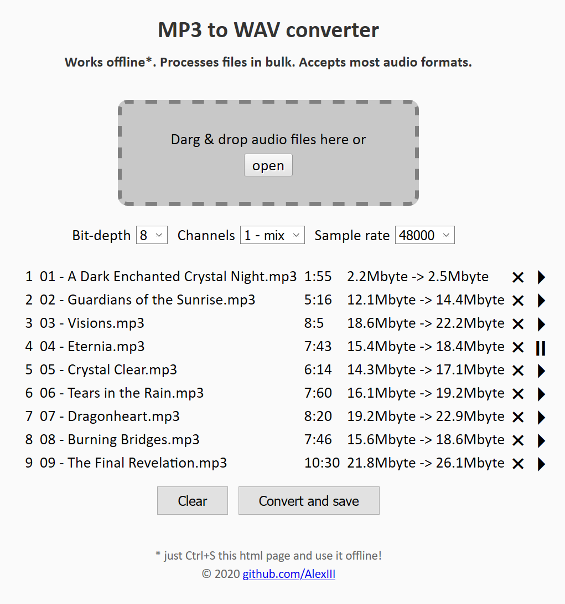

# MP3 to WAV converter

- Works offline
- Processes files in bulk
- Accepts most audio formats

[Try it here!](https://alexiii.github.io/web-wav-converter)

## Description

This is a single-page audio converter that uses in-browser API to convert any audio file into an uncompressed PCM [WAV](https://en.wikipedia.org/wiki/WAV) file.

The interface allows to change sample rate, bit-depth and channels prior to conversion and listen as to how the files would sound with the new settings.

For offline usage just download `index.html` and open it in a browser.

## What it's for

The primary use case for this app is converting audio files to use them in an embedded environment where you cannot afford to run audio decompression algorithms.

## Notice

It is recommended to use this converter in Firefox. Firefox provides much better resampling quality (compared to Chrome), which especially noticeable on low sample rates (e.g. 8000).

## License

MIT License © github.com/AlexIII
